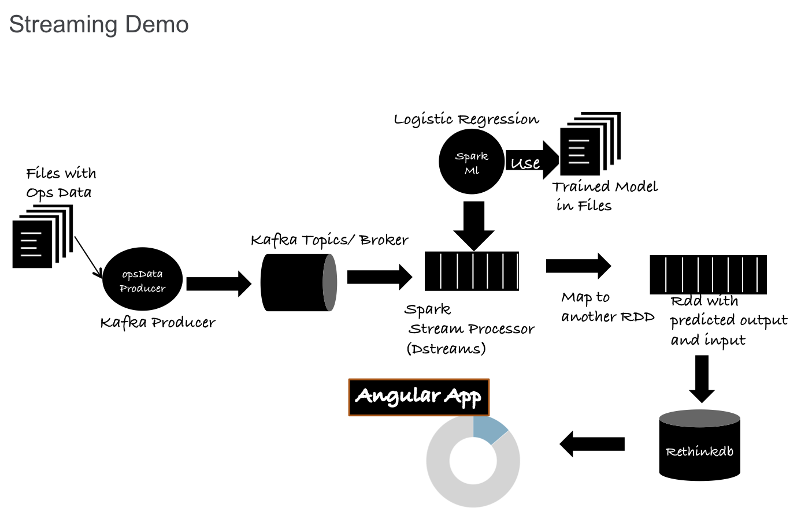

# Simple Dashboard example with RethinkDB, ExpressJS and AngularJS



### Dependencies
1. Install Node.js
2. Install RethinkDB
3. Install zookeeper with brew (brew install zookeeper)
4. Install Kafka with brew (brew install kafka)

### Steps to Run ###
1. Run `npm install` to install the dependencies.
2. Update ``app.js`` to include the correct path to `config.js`
3. Start zookeeper :  zkServer start (To start in background:  brew services start zookeeper)
4. Start Kafka: kafka-server-start /usr/local/etc/kafka/server.properties
5. Create a Kafka Topic : bin/kafka-topics.sh --create --zookeeper localhost:2181 --replication-factor 1 --partitions 1 --topic ops-data
(You can start Kafka server on different ports and increase the replication-factor to the number of brokers)
6. Start RethinkDB
6. Java Project - SparkJApp contains 4 main Classes
      - OpsDataProducer.java : Streaming Producer
      - OpsDataStreams.java : Streaming Consumer
      - OpsResult.java : A model that is used to write data to a persistent store
      - SparkLogisticRegression.java : Training class used to create a model for Operational data
7. Run SparkLogisticRegression.java  by modifying the path to training dataset. This will create a model in filesyste,
8. Run OpsDataStreams.java. This will kick off the consumer from Spark Topic. Configure the millisecond interval based on your need.
9. Run OpsDataProducer.java to read data and drop messages into kafka.
10. Start the webapp server with
```
node app.js
```
11. Browse to localhost:3000. The app loads a Donut chart based on the predicted outcomes that are written to RethinkDB.
